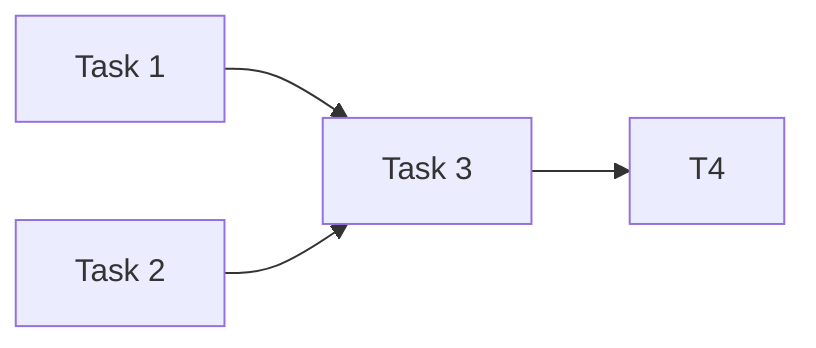

# Stage 4 — Task Breakdown + DAG/Wave 분할

`workflow-parallel` 8-stage 흐름의 4번째 단계. plan rev 와 Stage 3 codebase explore dossier 를 입력 받아 작업 단위를 의존 그래프로 묶고 Wave 단위로 분할.

## 입력

- 정제된 plan markdown (Stage 1~2 산출물)
- 작업별 explore dossier (`po-explore-<task>.md` 또는 메인 세션 컨텍스트의 Explore 결과)
- 사용자가 알린 부모 Epic (Stage 1 에서 수집)

## 실행 순서

### Step 1 — 작업 후보 추출

plan + explore 결과에서 atomic task 후보를 모두 나열. 각 후보에 다음 메타데이터를 채움.

- title (한 줄)
- scope (신규/변경/삭제 파일 목록)
- 추정 의존: 다른 task 의 산출이 선행되어야 하는가
- 회귀 위험 영역

### Step 2 — 의존 그래프 구성

각 task pair 에 대해 의존 여부 판단:

- **데이터 의존**: A 의 출력이 B 의 입력
- **파일 의존**: 같은 파일을 수정 → 같은 Wave 에 두면 충돌
- **빌드 의존**: A 의 타입/스키마 변경이 B 의 컴파일에 영향

판단이 모호하면 `AskUserQuestion` 으로 사용자 확인.

### Step 3 — Topological Sort + Wave 분할

```
Wave 1 = in-degree 0 task 집합
Wave N+1 = Wave 1..N 제외 후 in-degree 0
```

같은 Wave 안의 task 는 병렬 dispatch 가능. critical path (가장 긴 path) 식별.

### Step 4 — DAG 시각화

ASCII 또는 mermaid 로 그래프 출력. 사용자가 한눈에 의존 흐름 확인 가능해야 함.



### Step 5 — TODO.md 산출

`templates/todo.md` 스키마대로 작성. 위치는 `<repo>/TODO.md` (메인 세션 cwd 기준). 다음 섹션을 모두 채움.

1. 계획서 vs 실제 코드베이스 (Stage 3 결과 요약)
2. 실제 Jira 티켓 매핑 (Stage 5 에서 채움 — 자리만 잡고 placeholder)
3. 병렬 그룹 (Wave) — DAG 포함
4. 진행 전략 (Wave 단위 머지, critical path)
5. 진행 상태 (Stage 7 dispatch 후 채움)

### Step 6 — 사용자 확인

산출된 Wave 구성을 사용자에게 보고:

- 각 Wave 의 task 수
- critical path 길이
- 병렬도 (max width)

사용자 OK 후 다음 단계(Stage 5 — ticket 생성)로 진행.

## 종료 조건

- TODO.md 가 작성됨
- 사용자가 Wave 구성에 OK
- task 목록이 Stage 5 에 입력 가능한 형태로 구조화 (각 task = title + scope + 의존 + 테스트 전략 후보)

## Rules

1. 각 Wave 의 task 들은 반드시 의존 없음 — 같은 파일 수정도 회피
2. 의존 판단이 모호하면 사용자에게 물음. 추측 금지
3. critical path 가 길면 사용자에게 알리고 분할 가능성 제안
4. TODO.md 는 메인 세션 cwd 의 루트에 작성 (worktree 가 아님)
5. 한국어로 출력
